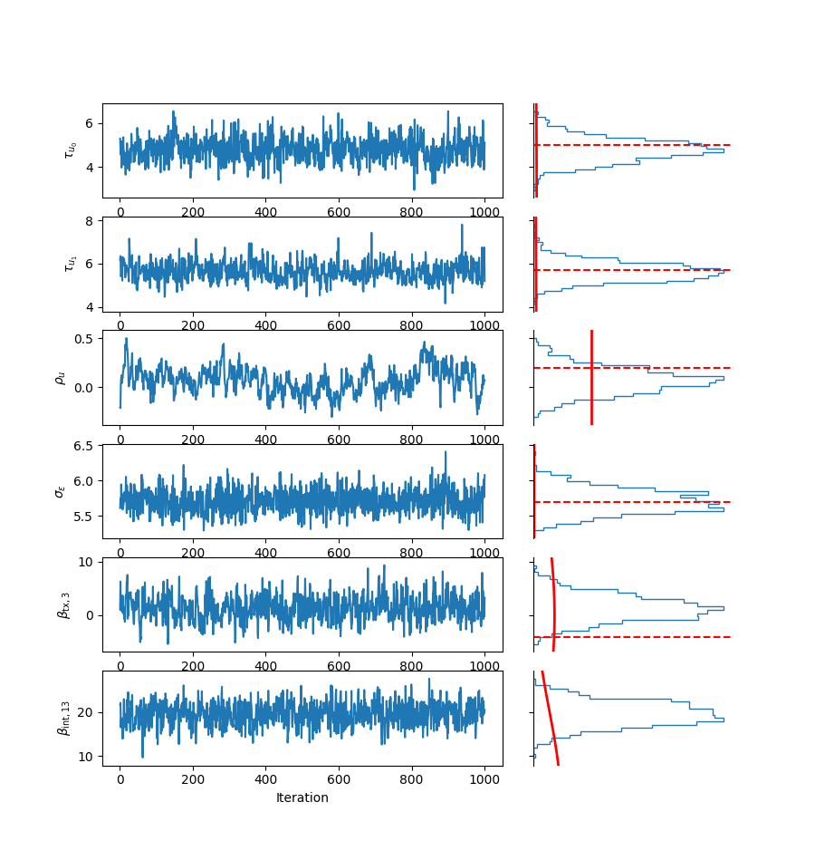
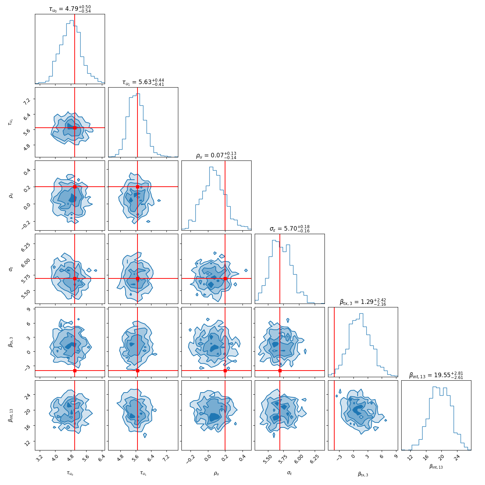
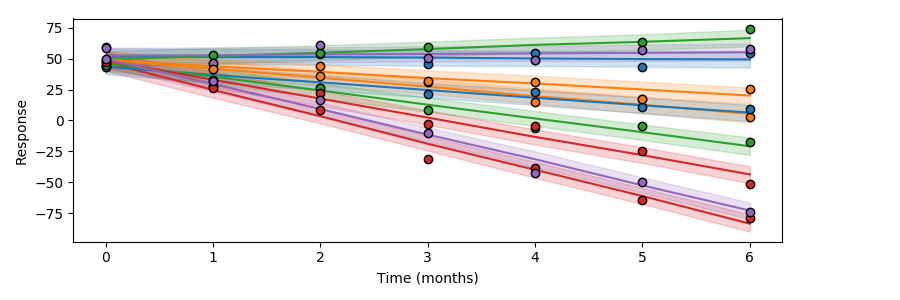
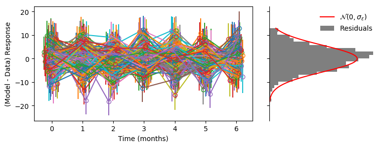
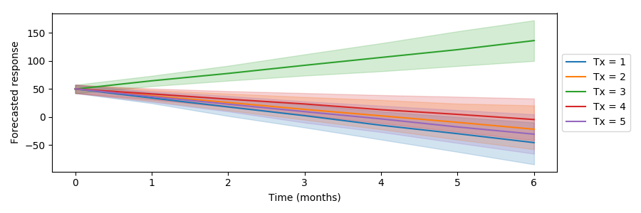

# The Model

We want to model patients' responses to treatment as a function of time.  The general modeling strategy is to start simple, only building up complexity once we have a good understanding of how it work and where more nuance is needed.

To that end, let's start with the following simplifications:

* We'll only consider one longitudinal measure of patient response (e.g., Karnofsky performance score).
* We'll assume that each patient gets one treatment, immediately after diagnosis.
* We'll assume that the effects we want to infer are linear with time.

## Tasks for the model:

1. Prediction: forward model patient response under different treatments, conditioned over degree of belief in model parameters.
2. Inference: update parameter probability distributions from observed patient response data.

## Basic linear response model

As alluded to above, the simplest thing possible would be to assume that patient response is a linear function of time.

$$y_i(t) = \alpha + \beta_1 x_1 t + \beta_2 x_2 t + \ldots + \epsilon$$

Here $y_i(t)$ is the response of patient $i$ at time $t$ and $\alpha$ is the intercept of the relation.
The slope is a linear combination of effect sizes, $\beta = (\beta_1, \beta_2, \ldots)$ over indicator variables $x = (x_1, x_2, \ldots)$.  These indicator variables take on values of 0 or 1 depending on whether or not a patient falls into some catagory (e.g., has a biomarker, has a treatment, or is in an age category).  The last parameter, $\epsilon$, represent measurement error.  Usually, we'll consider it to be drawn from a normal distribution with a mean of 0 and a standard deviation $\sigma_\epsilon$.

## Multi-level model

The model above assumes that the change observed in patient response is caused entirely by the patient's covariate ($x_1$, $x_2$, etc.).  But we almost certainly don't know all of the things that could effect patient response.  This motivates us to add additional parameters that model the patient-level effects on patient response.

Using the language of mixed models, these patient (or unit) effects would be considered "random effects" while the $\beta$ effect terms above (e.g., effects due to treatment) would be considered "fixed effects".

Let's denote the patient-level intercept and slope for patient $i$ to be $u_{0i}$ and $u_{1i}$ respectively.

Then our multi-level model for patient response can be written as

$$y_i(t) = (\beta_0 + u_{0i}) + \beta_1 x_1 t + \beta_2 x_2 t + \ldots + u_{1i} t + \epsilon$$

Note here that the former intercept parameter, $\alpha$, has been replaced by the sum of the patient-level intercept $u_{0i}$ and the patient-independent intercept, $\beta_0$.

Without any other assumptions, this would add two additional free parameter per patient to the model, making this model both computationally impractical and highy degenerate.  To ameliorate this, we'll assume that $u_i = (u_{0i}, u_{1i})$ is normally distributed with a mean of $\mu_u$ and a covariance matrix $\Sigma_u$.  Since $\mu_{u,0}$ is entirely degenerate with $\beta_0$, we fix this to be $0$. Thus, this nicely results in only four additional free parameters.  For sampling purposes, we'll parameterize the covariance matrix as a correlation matrix $\Omega_u$ with off-diagnal term $\rho_u$, times a diagonal matrix $\tau_u$.

## Biomarker, treatment, and interaction effects

For each patient, we have $N_\mathrm{bm}$ biomarkers (e.g., indicators of a genetic mutation).  Here we are considering biomarkers to be static with respect to time during the course of a treatment.  We are using a fairly loose definition of biomarkers, so these can also include features such as age, sex, tumor location, etc.  In practice, we may also combine these biomarkers into predictor variables (e.g., age crossed with tumor location).

There are $N_\mathrm{tx}$ different treatments available.  These represent potential actions for the patient to take.  While a treatment may represent an individual drug, it may also represent a combination of drugs or other treatments under consideration.

Independent of any treatment given, a patient's biomarkers likely have some information on how their performance score will change over time.  We'll denote these biomarker effects as $\beta_\mathrm{bm}$.  Whether or not a treatment successfully reduces tumor load, it's likely to have side effects affect the patient's response.  We'll denote treatment effects independent of biomarkers as $\beta_\mathrm{tx}$.

The true treatment effect is likely to be highly dependent on the patient's biomarkers.  We'll denote the interaction effects terms as $\beta_\mathrm{int}$.

Note that while $\beta_\mathrm{tx}$ is a vector of length $N_\mathrm{tx}$ and $\beta_\mathrm{bm}$ is a vector of length $N_\mathrm{bm}$, the interaction effect term, $\beta_\mathrm{int}$, can be thought of as a matrix of size $N_\mathrm{bm} \times N_\mathrm{tx}$.

## Bayesian inference

We now have $6 + N_\mathrm{bm} + N_\mathrm{tx} + N_\mathrm{bm} N_\mathrm{tx} + 2N_\mathrm{pt}$ model parameters, which we'll collectively denote as $\theta$.

$$ \theta = (\beta_0, \beta_\mathrm{tx}, \beta_\mathrm{bm}, \beta_\mathrm{int}, \mu_{u,1}, \tau_{u,0}, \tau_{u,1}, \rho_u, u, \sigma_\epsilon) $$

We have some prior belief about these parameters, denoted as $\mathrm{Prior}(\theta)$.  For considering the patient-level effects, $u$, we can view the parameters $\mu_u$, $\tau_u$, and $\rho_u$ as hyperparameters describing the prior over $u$.

For location or effect size parameters, we will assume a Gaussian prior distribution.  The hyperparameters can be chosen to be informative or not depending on the context (e.g., targeted therapy interaction terms).  For scale parameters (e.g., noise terms), we will assume a half Cauchy distribution with a large spread.

To calculate the likelihood of some data, $y_i(t)$, for patient $i$, given a model, $\theta$, we can multiply the likelihood of their random effect parameters, $(u_{i,0}, u_{i,1})$, by the likelihood of their response given $\theta$.

$$ \mathcal{L}(y_i(t) | \theta) = \mathcal{N}(u_i | \mu_u, \Sigma_u) \times \mathcal{N}(y_i(t) | \mu_y(\theta), \sigma_\epsilon) $$

where $\mu_y(\theta)$ is the mean response of the patient, given as 

$$\mu_y(\theta) = \beta_0 + u_{0,i} + u_{1, i} t + \sum_j (\beta_j x_{ij} t)$$

From Bayes' theorem, the change in the degree of belief over $\theta$ relative to the prior is equal to the predictive accuracy of $\theta$ relative to all other possible $\theta$ samples.  We call this updated degree of belief in $\theta$ the posterior probability of $\theta$ given that we have observed some data.

$$ \mathrm{Post}(\theta | y) \propto \mathrm{Prior}(\theta) \mathcal{L}(y | \theta) $$

Our goal in Bayesian inference is to compute (or at least approximate) the posterior probability distribution over $\theta$.  Since this calculation is often analytically intractable, we'll use Markov Chain Monte Carlo (MCMC) sampling to approximate this distribution by drawing samples from the distribution.  For a detailed overview of this class of algorithms, see [Neal 1993](http://www.cs.toronto.edu/~radford/ftp/review.pdf).

## Prediction

To generate predictions from the model, we first draw sample of $\theta$ from the distribution of interest (e.g., a fixed $\theta$ for mock data, or a posterior distribution for forecasting).  Then we draw $u$ from a Gaussian distribution with hyperparameters from $\theta$, and finally we draw $y$ from a Gaussian distribution with mean response $mu_y(\theta)$ and a standard deviation $\sigma_\epsilon$.

# The Data

The basic inputs for the model are:

* a patient response vector (one entry per response)
* a time-after-treatment vector (one entry per response)
* a patient index vector (one integer label per response)
* a biomarker matrix (one row of $N_\mathrm{bm}$ indicator variables per patient)
* a treatment matrix (one row of $N_\mathrm{tx}$ indicator variables per patient)

In addition, for doing inference, we need to specify hyperparameters, or parameters of our prior distributions over the model parameters.  When we instead want to predict data, then we don't need the patient response vector (we're generating this!) or the hyperparameters, but we will need to specify the model parameters.  These input parameters will either be a single set (e.g., for generating a mock dataset with a known "truth") or a list of samples from a posterior/prior distribution.

# Stan Workflow

[Stan](https://mc-stan.org/users/documentation/) is a probabilistic programming language.  Stan is statically typed and supports efficient array arithmetic.  It has interfaces with many popular programming languages, including Python, R, C++, and Julia.  The workhorse algorithm under the hood of Stan is the [No-U-Turn Sampler](http://jmlr.org/papers/volume15/hoffman14a/hoffman14a.pdf), an adaptive Hamiltonian Monte Carlo method.

## Overview of Stan

### Writing a Stan model

Stan programs are defined in a `*.stan` file, which can then be compiled by the interface language.  In the current version of Stan, this compilation process first generates C++ code from the stan file, then compiles this into an excecutable.

A Stan program is organized into code blocks that run during different parts of the sampling process.  Blocks need to be specified in a particular order, and variables defined in one block are accessible to blocks below that one.

In the `functions` block, we can define functions for use later in the program.  The `data` block declares variables that must be passed in by the user.  The `transformed data` block defines deterministic transformation of inputs.  Both this and the `data` block are only run once before starting sampling.

The `parameters` block declares variables for model parameters.  The `transformed parameters` block defines deterministic transformations of the model parameters.  This we be run once for every proposed set of model parameters during the sampling process.

The `model` block is where we define the probability distribution we wish to sample.  In Stan, this can be done with the sampling syntax $x \sim P(a, b)$, where $x$ is a previously declared variable (either from `data` in which case it is fixed for all samples, or from `parameters` in which case the value will be different everytime a new set of parameters is proposed during the sampling process), and $P(a, b)$ is some probability distribution known to Stan with parameters $a$ and $b$. For a list of pre-defined distributions, see the [Stan docs](https://mc-stan.org/docs/2_19/functions-reference/index.html).

Finally, the `generated quantities` block will store calculations made after a parameter proposal has been accepted by the sampler.  This is useful for drawing samples from a distribution of interest that does not impact the model, e.g., posterior predictive checks.

### Example Stan model

Below is a simple program for inferring the posterior probability distribution of the parameters of a Gaussian distribution.

```stan
data {
	// number data
	int N;
	vector[N] x;
	// vector of real (floating point) data
}

parameters {
	// mean of Gaussian
	real mu;
	// standard deviation of Gaussian, constrained to be positive
	real<lower=0> sigma;
}

model {
	// wide priors on model parameters
	mu ~ normal(0, 100);
	sigma ~ cauchy(0, 100);
	// likelihood
	x ~ normal(mu, sigma);
}

generated quantities {
	// generate z-scores for each accepted sample
	z = (x - mu) / sigma
}
```

### Running a Stan model

Here I'll describe the command line interface for Stan, known as [CmdStan](https://github.com/stan-dev/cmdstan).

Once CmdStan (and by extension, Stan itself) is installed, you can compile a Stan program by running `make` from the CmdStan directory on the Stan file, e.g., `cd path/to/cmdstan; make path/to/stanprogram/prefix`.  On a successful compilation, this will produce a C++ header file and an executable.

To run this model, we will need to provide the inputs (i.e., the variables in the `data` block).  This can be either in the form of a json file or an Rdump file.  We can then enter `./path/to/stanprogram sample data file=mydata.json` to sample from the model.

By default, this will use 1000 warmup samples and 1000 saved samples, and it will output samples to `output.csv`.  We can easily change this:

```shell
./stanprogram sample num_warmup=200 num_samples=2000 \
              data file=mydata.json                  \
              output file=myoutput.csv
```

Note that the `\` characters are used just for line breaks.

The csv output from Stan has a header with the inputs and settings used for the sampling.  The first row contains column labels, and each subsequent row has the next sample drawn from the distribution.  In addition to containing one column for each parameter, transformed parameter, and generated quantity, there are columns for the log probability as well as several quantities useful for diagnosing convergence.

## Using the patient response model

Currently, I have two Stan programs (`predict.stan` and `infer.stan`), one for each of the tasks listed at the top of this document.  Each file shares quite a bit of code, since in principle, prediction is just inference but switching the inputs and the outputs.

### Generating a mock dataset

Generating a mock dataset involves sampling the predictive patient response distribution for a single set of parameters.  The `mock_input.json` file shows an example input file for `predict` for 125 patients, tracking five biomarkers and five treatments.  Patients in this mock dataset receive one treatment (implicitly at $t = 0$), chosen at random.

```shell
./predict sample num_warmup=200 num_samples=1 \
          data file=mock_input.json           \
		  output file=mock_res.csv
```

This should run in much less than a second.  The `mock_res.csv` file now contains a single sample of patient-level random effects and the simulated patient response vector.

### Inference on a dataset

Regardless of whether the data real or mocked up, we can use the `infer` program in a similar fashion.

```shell
./infer sample num_warmup=200 num_samples=1000 \
        data file=infer_input.json             \
		output file=inferred.csv
```

Here, unlike in generating a mock dataset, we want to draw some large ($\sim 1000$) number of samples.  The `infer_input.json` file is similar to the `mock_input.json` file, however instead of providing fixed model parameters, we provide hyperparameters and a patient response vector.

For the mock dataset with 125 patients, five biomarkers and five treatments, it should take around ten minutes to draw 1000 samples from the posterior probability distribution.

To automatically generate inputs for an inference on a mock dataset, we can use the `predict_from_infer()` function in the Python script, `glue.py`.  Or we can call this from the command line:

```shell
python3 glue.py infer_input.json infer mock_res.csv mock_input.json
```

### Evaluating inference outputs

Usually the model will converge quite quickly, within 200 iterations or so.  To quickly see if the model needs more warmup iterations, plot the traces of the parameters (i.e., the position in parameter space at each iteration).  If there is a rapid jump in parameter space or a trend with number of iterations, you need more warmup iterations.  The `traceplot()` function in `stanplots.py` is helpful for looking at traces of multiple parameters at once.

```python
parameters = stanplots.parse_parameters(["beta_int.13", "beta_tx.3", 
	                                    "tau_u.1", "tau_u.2", 
										"rho_u", "sigma_eps"], 
										predict_input="mock_input.json", 
										infer_input="infer_input.json")
fig = stanplots.traceplot("inferred.csv", parameters)
```


Quantifying convergence is best done by running multiple chains and calculating the $\hat{R}$ (or Gelman-Rubin) statistic on the resulting outputs.  This should be equal to one at convergence.  The `stansummary` program, packaged with CmdStan will compute this, as will the `rstan` or `pystan` inferfaces.

To look for degeneracies in the model, you can plot the 2D marginalized posterior distributions.  The `cornerplot()` function in `stanplots.py` will plot a grid of covariance plots between each set of two parameters in the model.  Strange-looking (e.g., highly non-Gaussian) distributions in this plot may be an indication of model mis-specification.  Degenerate parameters will show highly correlated joint distributions.

```python
fig = stanplots.cornerplot("inferred.csv", parameters)
```


Posterior predictive checks (distribution of data marginalized over the posterior) are also helpful for diagnosing any problems.  The `ppcplot()` function in `stanplots.py` will plot the posterior predictive patient response distributions for a subset of patients and compare this with the actual patient response data.

```python
fig = stanplots.ppcplot("inferred.csv", "infer_input.json", patients=10)
```


Lastly, we have assumed that the residuals in the model are Gaussian and do not depend on time.  This is a good thing to check.  The `residualplot()` function will plot the distribution of the difference between the data and the model, as well as the inferred residual distribution.

```python
fig = stanplots.residualplot("inferred.csv", "infer_input.json")
```



### Forecasting patient response

We can use the posterior probability distribution draws from the inferences to predict the treatment responses of new patients.

The `glue.py` script can generate the necessary input file for doing set of predicted patient responses for each treatment under consideration.

```shell
python3 glue.py forecast_input.json predict \
  inferred.csv infer_input.json             \ 
  --bm new_patient_bm.json
```

We can run this prediction with the `predict` Stan program.

```shell
./predict sample num_warmup=200 num_samples=1000 \
	      data file=forecast_input.json          \
		  output file=forecasted.csv
```

Finally, we can plot the predictive patient response distributions with the `forecastplot()` function from `stanplots.py`.

```python
fig = stanplots.forecastplot("forecasted.csv", "forecast_input.json")
```

